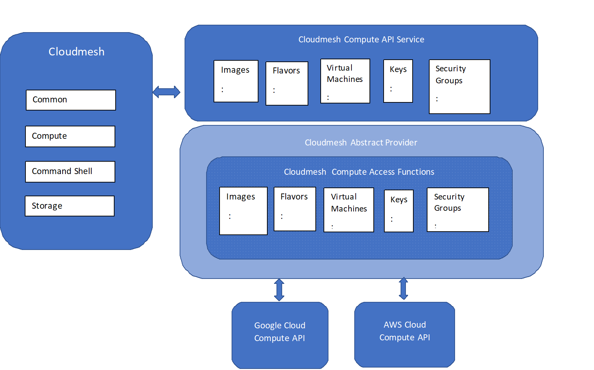

# Cloudmesh Compute Project for Google Cloud Platform (GCP)

Harshawardhan Pandit, [fa19-516-169](https://github.com/cloudmesh-community/fa19-516-169)

## Abstract

Cloudmesh enables you to access multi-cloud environments such as AWS,
Azure, Google, and OpenStack Cloudsvery easily. The purpose of this
project is to implement identified features for the **Google Cloud
Platform**.  The two cloud interface will be implemented using:

1. Google Cloud Platform
1. AWS

Selected APIs will be added for the following features:

1. Images
1. Flavors
1. Virtual machines
1. Keys
1. Security groups

## Architecture

## APIs

Typical List of APIS to be developed may include in the follow
categories:

1. VM

   1. start
   1. reboot
   1. stop
   1. resume
   1. suspend
   1. info
   1. status
   1. list
   1. create
   1. create_vm_parameters

1. Flavors

   1. flavor

1. image

   1. image

1. keys

   1. keys
   1. key_uplo
   1. key_delete

1. Security groups

   1. ssh
   1. get_resource_group
   1. set_server_metadata
   1. delete_server_metadata
   1. list_secgroups
   1. list_secgroup_rules
   1. add_secgroup
   1. add_secgroup_rule
   1. remove_secgroup
   1. upoad_secgroup
   1. add_rules_to_secgroup
   1. remove_rules_from_secgroup

## Technologies

The following tehcnologies are used

* Python 3.7.4
* REST API
* Cloudmesh

## References

1. <https://cloudmesh.github.io/cloudmesh-manual/projects/project-compute.html>
1. <https://github.com/cloudmesh/cloudmesh-cloud/tree/master/cloudmesh/compute>
